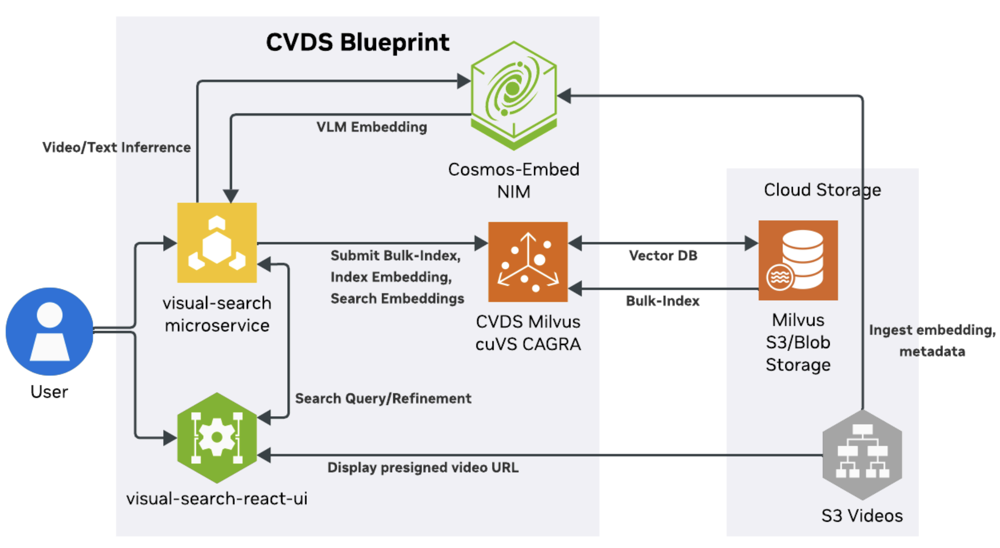

# NVIDIA Cosmos Dataset Search (CDS)

NVIDIA Cosmos Dataset Search (CDS) is a comprehensive platform for semantic search across video datasets using advanced AI models. The platform enables text-to-video and video-to-video queries against large-scale video collections with GPU-accelerated inference and vector similarity search.

## Key Features

### Search and Retrieval
- Multimodal semantic search with text and video queries
- GPU-accelerated embedding generation using NVIDIA Cosmos-embed NIM
- Fast vector similarity search powered by Milvus with NVIDIA cuVS acceleration
- Support for multiple collections and cross-modal retrieval

### Data Management
- Automated video ingestion pipeline with frame extraction and metadata indexing
- S3-compatible object storage (LocalStack, MinIO, AWS S3)
- Batch and incremental data ingestion with Ray-based parallel processing
- Support for various video formats and frame rates

### User Experience
- Interactive React-based web UI for search and data curation
- REST API for programmatic access with comprehensive documentation
- CDS CLI for collection management and data ingestion
- Real-time search results with video previews and metadata

### Deployment and Operations
- Flexible deployment: Docker Compose for local development, Helm for production
- Production-ready Helm charts for AWS EKS and generic Kubernetes
- Comprehensive monitoring, logging, and observability
- Modular architecture enabling independent scaling of components

## Software Components

### NVIDIA NIM Microservices
- **[Cosmos-embed NIM](https://docs.nvidia.com/nim/cosmos-embed1/latest/introduction.html)** - Unified embedding service providing state-of-the-art text and video embeddings in a common semantic space optimized for temporal understanding and cross-modal search.

### Integration and Orchestration Layer
- **Visual Search Service** - FastAPI-based REST API orchestrating ingestion and search operations
- **Milvus Vector Database** - GPU-accelerated vector storage and similarity search with NVIDIA cuVS
- **Object Storage** - S3-compatible storage for video files, frames, and metadata (LocalStack, MinIO, or AWS S3)
- **Web UI** - React-based interface for interactive search, browsing, and data curation

## Technical Diagram



The diagram illustrates the complete CDS architecture showing the flow from data ingestion through embedding generation to search and retrieval via both the web UI and REST API.

## Workflow

1. **Install Prerequisites** - Set up required software and dependencies for your chosen deployment method.
2. **Deploy Services** - Launch CDS using Docker Compose for local deployment or Helm charts for Kubernetes deployment.
3. **Create and Manage Collections** - Use the CDS CLI or REST API to create vector collections for organizing your video datasets.
4. **Ingest Video Data** - Upload videos using the ingestion pipeline or bulk indexing, which processes videos and extracts embeddings.
5. **Search via Web UI** - Access the interactive web interface to perform text-to-video or video-to-video searches with real-time results.
6. **Search via CLI or API** - Query collections programmatically using the CDS CLI or REST API for integration into workflows and applications.

## Deployment Options
CDS supports two primary deployment methods: Docker Compose for local or small-scale setups, and Kubernetes with Helm charts for scalable, production-grade environments. Easy setup and deployment guides for both methods are provided below.

### Docker Compose Deployment

Best for local development, testing, and small-scale deployments. All services run on a single node with simplified configuration.

- **[Docker Compose Deployment Prerequisites](docs/docs/docker-compose-prerequisites.md)** - System requirements and setup
- **[Docker Compose Deployment Guide](docs/docs/docker-compose-deployment.md)** - Step-by-step deployment instructions
- **[Docker Compose Troubleshooting](docs/docs/troubleshooting-docker-compose.md)** - Common issues and solutions

### Kubernetes Deployment with Helm

Recommended for production deployments requiring scalability, high availability, and enterprise features.


#### Deployment Guides

- **[AWS EKS Deployment](docs/docs/aws-eks-deployment.md)** - Deploy on Amazon Elastic Kubernetes Service
- **[Red Hat OpenShift AI Deployment](docs/docs/openshift-deployment.md)** - Deploy on Red Hat OpenShift AI (RHOAI)

## Using CDS

After deploying CDS, you can interact with the system through three primary methods: Web UI, REST API, and CLI. The user guide provides quickstart tutorials for each interface.

### User Guide

**[CDS User Guide](docs/docs/user-guide.md)** - Interactive tutorials for Web UI, REST API, and CLI

## Documentation

For comprehensive documentation, see the **[Complete Documentation Index](docs/docs/documentation.md)**.

## Repository Structure

```
cds/
├── src/                          # Source code
│   ├── visual_search/           # Visual search service
│   ├── haystack/                # Haystack integration components
│   ├── models/                  # Model implementations
│   └── triton/                  # Triton inference server configs
├── deploy/                       # Deployment configurations
│   ├── services/                # Docker Compose configs
│   └── standalone/              # Standalone deployment options
├── infra/                        # Infrastructure as code
│   └── blueprint/               # Helm charts and Kubernetes manifests
├── docs/                         # Documentation
│   ├── docs/                    # User documentation
│   └── guides/                  # Deployment and usage guides
├── scripts/                      # Utility scripts
│   ├── evals/                   # Evaluation scripts
│   └── performance/             # Performance testing tools
└── tests/                        # Test suites
```

## License

This project is licensed under the terms specified in the [LICENSE](LICENSE) file. This project may download and install additional third-party open source software. Review the license terms of these open source projects before use.

## Security

For security concerns, please refer to our [Security Policy](SECURITY.md).

## Security Considerations
The Cosmos Dataset Search Blueprint is shared as a reference and is provided "as is". The security in the production environment is the responsibility of the end users deploying it. When deploying in a production environment, please have security experts review any potential risks and threats; define the trust boundaries, implement logging and monitoring capabilities, secure the communication channels, integrate AuthN & AuthZ with appropriate access controls, keep the deployment up to date, ensure the containers/source code are secure and free of known vulnerabilities.
