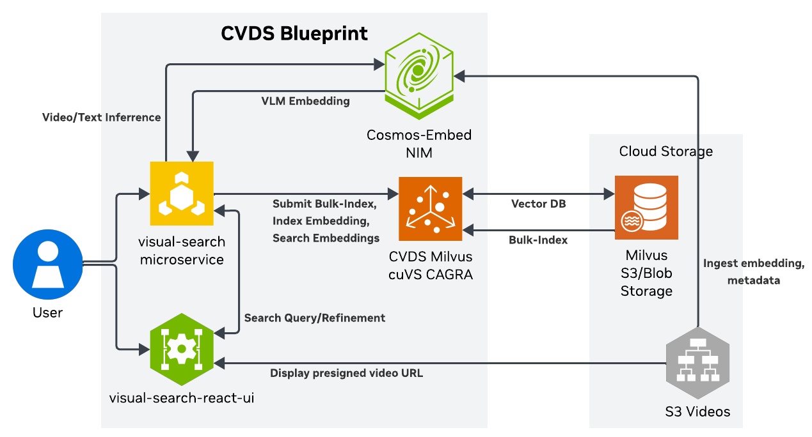

# Introduction

Cosmos Video Dataset Search (CVDS) is a suite of visual search and analytics micro-services to ingest, index,
search and curate multi-modal data with a focus on video understanding and temporal reasoning.

The system has the following main components:

* A Core Service orchestrating ingestion and search queries.
* **Cosmos Embed NIM Service**: A unified embedding service powered by the state-of-the-art NVIDIA Cosmos model,
  providing superior text and video embeddings in a common semantic space.
* A vector database (Milvus) to store embeddings and perform embedding-space search.
* A Postgres service to store the metadata associated with a collection, including external storage secrets.
* A UI service allowing web-based interactive queries and visualization.

In the above diagram:

* The indexing service indexes a volume of videos and associated text (either from scratch or incrementally) and creates an
  immutable index associated with the volume name and version.
* A retrieval service retrieves assets from the queried volume by loading and querying the associate
  index. The retrieval service can be queried programmatically or via a web GUI which does client-side rendering.
* The Cosmos Embed NIM service embeds high dimensional video and text data into a unified low-dimensional semantic space
  optimized for temporal understanding and cross-modal search.
