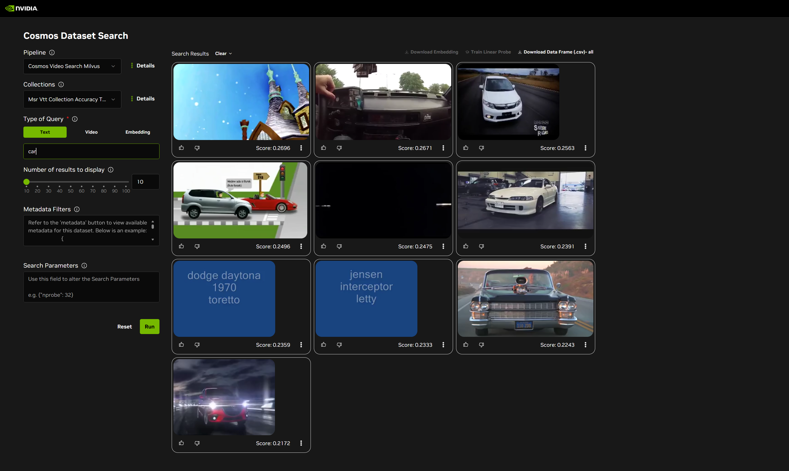
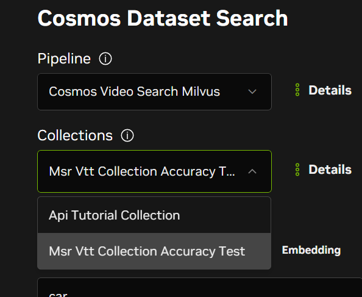
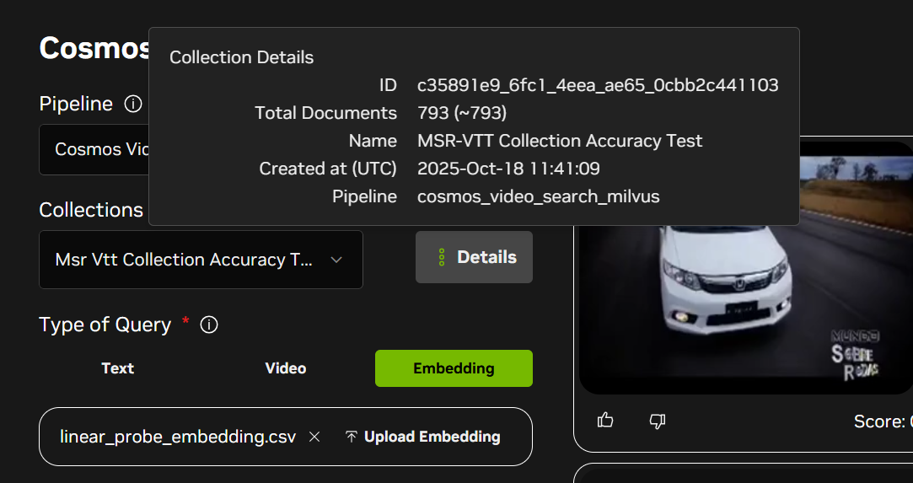
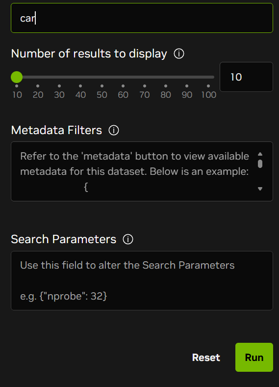
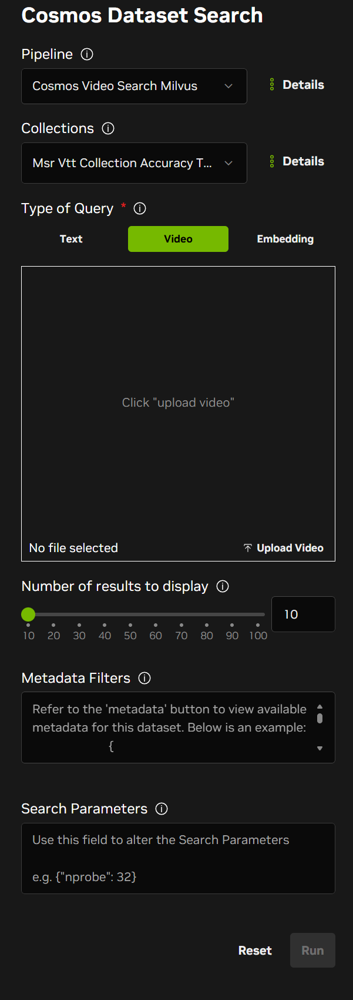
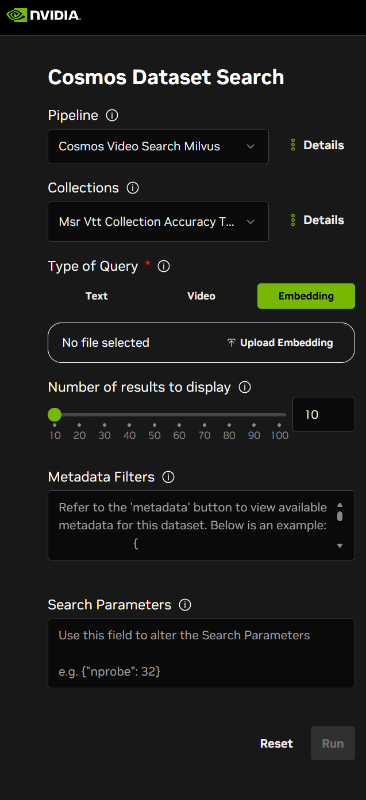
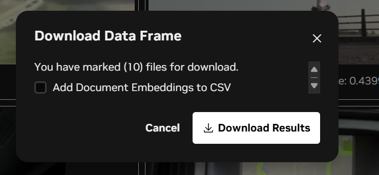
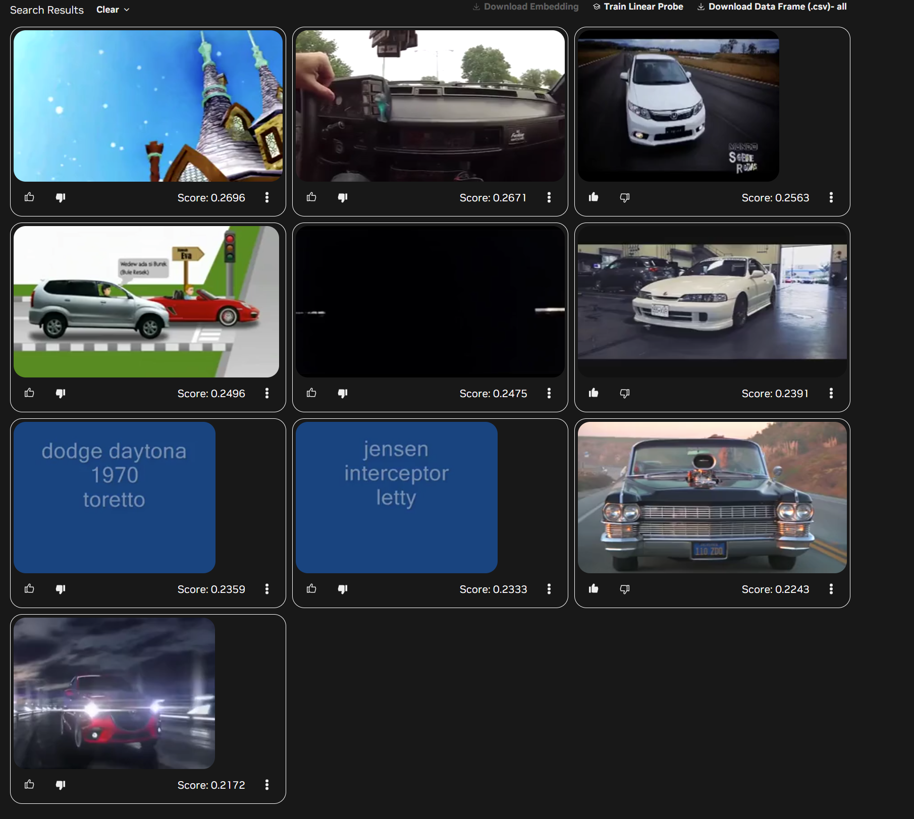
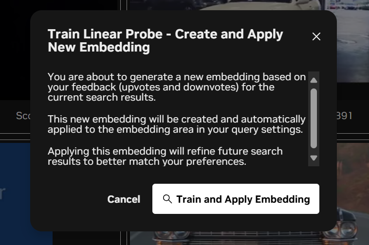
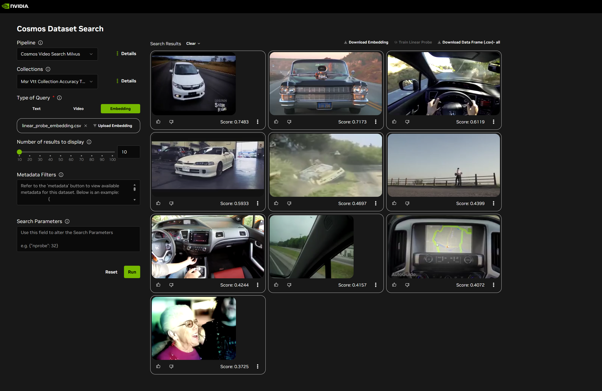

# CDS Web User Interface User Guide

The CDS Web UI provides an interactive visual interface for exploring video collections and performing semantic searches.

## Accessing the Web UI

### Docker Compose Deployment

After starting CDS with Docker Compose, access the UI at:

```
http://localhost:8080/cosmos-dataset-search
```

**Note**: The web browser must be running on the localhost for access to succeed.

### Kubernetes Deployment

After deploying CDS on AWS EKS, access the UI through your ingress endpoint:

```
https://<hostname>/cosmos-dataset-search
```

Where `<hostname>` is your AWS load balancer hostname obtained from the ingress configuration. See the [AWS EKS Deployment Guide](aws-eks-deployment.md#step-7-get-deployment-urls) for details on retrieving your deployment URL.

## UI Overview

The CDS Web UI provides a comprehensive interface for semantic video search and data curation:



### Key Features

The UI offers the following capabilities:

- **Collection and Pipeline Management** - Select and manage video collections and embedding pipelines
- **Multiple Search Modes** - Perform text-to-video, video-to-video, and embedding-based searches
- **Visual Search Results** - Browse search results with video thumbnails and similarity scores
- **Download Search Results** - Export search results for further analysis
- **Linear Probe Training** - Train custom embeddings based on labeled search results

## Collections and Pipelines

### Pipeline and Collection Selection



Use the dropdown menus at the top of the interface to:

1. **Select Pipeline** - Choose the embedding pipeline to use for search (e.g., `cosmos_video_search_milvus`)
2. **Select Collection** - Choose which video collection to search within

### Collection Details



View detailed information about the selected collection, including:

- Collection name and ID
- Total number of videos indexed
- Storage configuration
- Embedding pipeline used for indexing

## Search Types

CDS supports three types of semantic search operations:

### Text-to-Video Search



Enter natural language text queries to find relevant video segments. Simply type your query (e.g., "person walking", "cat playing") and click search to retrieve semantically similar videos.

### Video-to-Video Search



Upload a query video to find similar content in your collections. The system compares video embeddings to identify visually and semantically similar videos.

### Embedding Search



Search using embedding vectors directly. This advanced mode allows you to query using pre-computed embeddings or custom embedding vectors.

## Download Search Results



After performing a search, you can export the results for further analysis:

1. Review your search results
2. Click the **Download** button
3. Choose your preferred export format
4. Save the results file containing video metadata, similarity scores, and file paths

## Linear Probe Training

The Linear Probe feature allows you to train custom embeddings based on your feedback on search results. This helps improve search relevance for your specific use case.

### Step 1: Select Training Examples



1. Perform a search to get initial results
2. Review each result and mark it as **Thumbs up** (relevant) or **Thumbs down** (not relevant)
3. Label at least several examples to provide training data
4. Click the **Linear Probe** button when ready

### Step 2: Confirm Training



1. Review your selections (number of positive and negative examples)
2. Confirm the training configuration
3. Click **Train** to start the linear probe training process

The system will train a custom embedding based on your labeled examples.

### Step 3: View Results with Trained Embedding



After training completes:

1. The search results update automatically using the newly trained embedding
2. Results are re-ranked based on the learned preferences
3. Videos matching your criteria should now rank higher
4. You can perform additional searches using this custom embedding

The trained embedding helps the system better understand what types of videos are relevant for your specific search intent.

## Related Documentation

For complete documentation on all CDS features and deployment options, see:

- [Complete Documentation Index](documentation.md)
- [User Guide Overview](user-guide.md)
